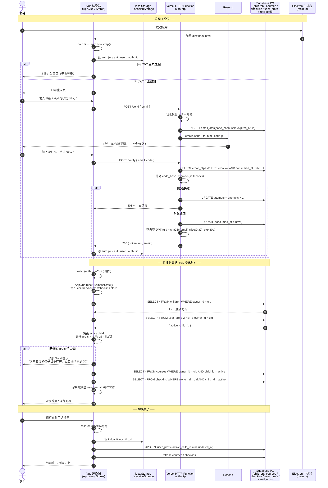

# AGENTS.md

> 给 AI agent / 未来自己的项目入口文档。先读这一篇再动手。

## 1. 项目是什么

**一寸光阴** —— 家长自用的桌面应用（Windows）+ 远端 PG 同步，记录孩子的课外培训班课程 / 缴费 / 打卡 / 课时统计。

- **不是**：多人协作 / 商业化 / 通知推送 / 课程评价
- **是**：单账号、多孩子、多课程；多设备登录看到一样的数据

## 2. 架构总览（2026-08 重写）

### 2.1 部署视图

```
┌────────────────────────────────────────────────────────┐
│  Electron 33 桌面端（Windows）                          │
│  ├─ Vue 3.5 + TS + Pinia + Element Plus + Tailwind     │
│  ├─ 渲染端路由：5 页面（home/courses/checkins/stats/   │
│  │              settings/login）                        │
│  ├─ 主进程（electron/main.ts）：窗口、preload、IPC     │
│  └─ 启动时自动开 DevTools：dev 模式；生产默认不开       │
└────────────────────────────────────────────────────────┘
                       │ VITE_AUTH_OTP_URL
                       ▼
┌────────────────────────────────────────────────────────┐
│  Vercel Functions (Node 20, 自托管)                      │
│  ├─ api/auth-otp/[action].js (HTTP Function)            │
│  │    POST /send             发 6 位验证码邮件（Resend） │
│  │    POST /verify           校验码 + 签自签 JWT（30d）   │
│  │    POST /login            邮箱+密码登录（scrypt 比对） │
│  │    POST /register         注册（验证码 + 设密）        │
│  │    POST /set-password     验证码确认后 设/改密码       │
│  │    POST /reset-password   忘记密码重置（同 set）       │
│  │    POST /change-password  改密（需 Bearer + 旧密码）   │
│  │    GET  /password-status  查询当前账号是否设过密码     │
│  │    GET  /health           健康检查                     │
│  ├─ api/data-api.js (HTTP Function)                      │
│  │    GET  /health           健康检查                     │
│  │    GET/POST/PATCH/DELETE /b/:table  业务 CRUD         │
│  │      （children/courses/checkins/user_prefs/         │
│  │        user_passwords/email_otps）                    │
│  │    ★ 业务安全：owner_id 服务端从 JWT 强制注入，       │
│  │      表名/写入列/过滤列/排序列全白名单                │
│  ├─ lib/db.js   postgres.js 池（事务模式 pooler :6543）  │
│  ├─ lib/auth.js  requireAuthAsync + CORS 头 + JWT 验签   │
│  ├─ lib/jwt.js  signJwt / verifyJwt（共享密钥）          │
│  └─ uid = sha256(email).slice(0, 32)  ← 跨设备稳定      │
└────────────────────────────────────────────────────────┘
                       │ DATABASE_URL (Supabase 事务模式 pooler :6543)
                       ▼
┌────────────────────────────────────────────────────────┐
│  Supabase PostgreSQL (public schema)                    │
│  ├─ children   id, owner_id, name, emoji, color, ...    │
│  ├─ courses    id, owner_id, child_id, total_hours, ... │
│  ├─ checkins   id, owner_id, child_id, course_id, ...   │
│  ├─ email_otps OTP 临时记录（hash + salt + attempts）    │
│  ├─ user_prefs  owner_id PK + active_child_id + theme   │
│  ├─ user_passwords  email PK + scrypt 哈希（v0.3+）     │
│  └─ backups  pg_cron 每日 03:03 快照（4 业务表 → JSONB）│
│                                                        │
│  ✅ RLS 已开启 + anon policy/权限已删（20260817000000） │
│     anon 直连 PostgREST：无 policy + 无权限 → 全拒      │
│  ✅ pg_cron 扩展已启用，backup_snapshot() 自动跑         │
└────────────────────────────────────────────────────────┘
                       │ service role (BYPASSRLS)
                       ▲
       渲染端 fetch data-api /b/* 带 Authorization: Bearer <自签JWT>
```

**部署**：
- Vercel GitHub auto-deploy：push `main` → Vercel 自动 build + 部署最新 commit
- 发版：push `v*` tag → GitHub Actions `.github/workflows/release.yml` 跑 desktop 端 electron-builder 打包
- env 注入：Vercel 控制台 → Settings → Environment Variables（DATABASE_URL / JWT_SECRET / RESEND_API_KEY / MAIL_FROM）

**数据隔离**：业务读写**全部走 data-api 云函数**，`owner_id` 由服务端从 JWT 注入（前端传的一律忽略）；数据库层 RLS 已开 + anon policy/权限已删，即使拆包拿到 publishable key 直连 PostgREST 也被拒。

### 2.2 端到端流程（mermaid）

下面是从"打开 app"到"看到首页数据"的完整时序图，**包含登录 / 拉数据 / 切换账号**三条主要链路。



**关键时序点**：
- **步骤 1-8**：启动 + 登录（OTP 限流按 IP + 邮箱双维度，详见 `vercel/api/auth-otp/[action].js`）
- **步骤 9-13**：拉数据（`resetBusinessState` 必跑，避免上一个账号的 store 残留）
- **步骤 14-17**：切换孩子（云端 user_prefs + 本地 localStorage 双写）

### 2.3 数据流概览（mermaid）

```mermaid
%%{init: {'theme': 'default'}}%%
flowchart LR
    subgraph Desktop["Electron 桌面端"]
        UI[Vue 组件]
        Store[Pinia Stores<br/>auth / children /<br/>courses / checkins]
        Lib[lib/cloudbase.ts<br/>fetch + JWT session<br/>（文件名沿用历史）]
    end

    subgraph Vercel["Vercel Functions（自托管）"]
        Otp[api/auth-otp<br/>HTTP Function]
        Data[api/data-api<br/>HTTP Function]
    end

    subgraph Supabase["Supabase 云端"]
        Cron[pg_cron 03:03]
        PG[(Supabase PG<br/>public schema)]
    end

    subgraph Third["第三方"]
        Resend[Resend<br/>邮件服务]
    end

    UI -->|点击 + 读 store| Store
    Store -->|businessApi()<br/>GET/POST/PATCH/DELETE /b/*| Lib
    Lib -->|fetch /api/data-api<br/>service role 直连| Data
    Data --> PG

    UI -.sendCode.-> Otp
    Otp -->|写 email_otps| PG
    Otp -->|发邮件| Resend
    Otp -.verify (签 JWT).-> UI

    Cron -.定时触发.-> PG
    Cron -->|INSERT backups| PG
```

**关键边界**：
- 渲染端**只走** data-api HTTP Function（`businessApi` → `/b/*`），**不**直连 PostgREST、**不**用数据库 key
- 业务读写权限 = 服务端 JWT（owner_id 强制注入）+ RLS 开启 + anon 无 policy/权限 三件套
- `auth-otp` / `data-api` 是 Vercel **HTTP Function**，都通过 Supabase pooled connection 直连 PG（service role，BYPASSRLS）
- pg_cron 替代了旧 CloudBase pg-backup Event 函数，每日 03:03 自动跑 `backup_snapshot()`

## 3. 目录速览

```
kid-course-tracker/
├── AGENTS.md                ← 你正在读
├── .github/workflows/
│   └── release.yml          ← 桌面端发版：推 v* tag → electron-builder 打 NSIS+portable
├── vercel/                  ← Vercel Functions + lib
│   ├── vercel.json          ← rewrites：/api/data-api/* → ?path=*
│   ├── package.json
│   ├── .env.local           ← 仅本机（gitignored，含 DATABASE_URL）
│   ├── api/
│   │   ├── auth-otp/
│   │   │   └── [action].js  ← HTTP Function（send/verify/login/register/set/reset/change/password-status/health）
│   │   └── data-api.js      ← HTTP Function（health + /b/* 业务 CRUD）
│   └── lib/
│       ├── db.js            ← postgres.js 池（事务模式 pooler :6543）
│       ├── auth.js          ← requireAuthAsync + CORS 头
│       └── jwt.js           ← signJwt / verifyJwt（共享密钥）
│
├── supabase/
│   ├── config.toml          ← Supabase CLI 配置
│   └── migrations/          ← SQL migration（按文件名升序手动应用）
│       ├── 20260908000001_init_schema.sql         ← 6 业务表 + RLS
│       ├── 20260908000002_harden_security.sql      ← 删 anon policy + revoke
│       ├── 20260908000003_daily_backup_cron.sql   ← pg_cron + backup_snapshot()
│       ├── 20260909140000_user_prefs_theme.sql    ← user_prefs 加 theme 列
│       ├── 20260909173709_fix_email_otps_seq.sql  ← 修 email_otps 序列不同步
│       └── ...
│
├── desktop/                 ← 桌面端
│   ├── AGENTS.md            ← 桌面端专属约定
│   ├── README.md            ← 安装/构建/运行文档
│   ├── package.json
│   ├── vite.config.ts       ← Vite + @ 别名
│   ├── tsconfig*.json
│   ├── build/installer.nsh  ← NSIS 卸载"清除本地数据"复选框脚本
│   ├── electron/            ← 主进程 + preload
│   │   ├── main.ts
│   │   ├── updater.ts       ← 版本检查（GitHub 双通道）
│   │   └── preload.ts
│   ├── src/                 ← 渲染端源码
│   │   ├── main.ts          ← 入口：auth bootstrap → mount
│   │   ├── App.vue          ← 顶层：登录态切换 + 业务数据 load
│   │   ├── router/          ← 5 页面 + 守卫
│   │   ├── views/           ← 页面（Home/Courses/Checkins/Stats/Settings/Login）
│   │   ├── components/      ← 通用 + 业务组件
│   │   ├── stores/          ← Pinia：auth/children/courses/checkins/db
│   │   │   └── children.ts  ← 包含 user_prefs 激活孩子同步
│   │   ├── lib/cloudbase.ts ← fetch + JWT session（文件名沿用历史）
│   │   ├── types/           ← 共享 TS 类型
│   │   ├── utils/           ← 日期/金额/校验/Excel
│   │   └── styles/
│   └── release/             ← electron-builder 产物
│
└── .agents/                 ← Mavis agent 配置
```

## 4. 核心约定

### 4.1 鉴权流程（v0.4+：密码为主，邮箱为辅；注册改为"先验证邮箱再设密"）

**核心思路**：密码是主凭证，邮箱**仅用于**注册/找回/改密时的身份验证。注册即设密，登录走密码，不存在"只有邮箱没密码"的合法状态。

#### 三种主流程

**1. 注册（v0.4+：先验证邮箱，再设置密码）**：
- `Login.vue` 密码 Tab 底部 "点此注册" → `RegisterDialog`
- Step 1: 邮箱 + 6 位邮箱验证码（前端仅校验格式，不发请求）
- Step 2: 密码 + 确认密码（前端校验 ≥ 8 位含字母数字 + 两次一致）→ Step 3: 自动登录 + 跳首页
- 后端链路（`auth.register` 内部组合两个端点）：
  - **第 1 步**：`POST /verify` → 消费 OTP + 签 JWT → store 存 session
  - **第 2 步**：`POST /set-password` 带 Bearer JWT → 后端**不消耗 OTP**、要求 body.email 与 JWT.email 一致、邮箱已注册 → `409 email_already_registered`、未注册 → 写 hash
- **邮箱已注册**（第 2 步 409）：store 已经在第 1 步写入 session；UI 引导用户去登录页
- **安全设计**：
  - Bearer 路径校验 `body.email === jwt.email`（防 A 拿自己 token 给 B 设密）
  - Bearer 路径不消耗 OTP（验证码已在第 1 步用掉）
  - OTP 路径（`ForgotPasswordDialog`）保持 v0.3 行为不变，向后兼容
- `/register` 老端点**保留**（v0.3 一次性走完的版本，不删除以免破坏旧版 App），但前端不再调用

**2. 登录（`/login`，默认主路径）**：
- `Login.vue` 密码 Tab（默认）→ 邮箱 + 密码 → `/login`
- 成功签与 `/verify` **完全相同的 JWT**，data-api / owner_id 逻辑零改动
- **安全设计**：
  - 密码 ≥ 8 位含字母数字（前端 + 服务端双重校验）
  - 登录失败统一返回 `invalid_credentials`（防邮箱枚举）
  - 按 email 连续失败 5 次锁 15 分钟（内存 Map `loginFails`，冷启动重置可接受）
  - 未设密码的邮箱 `/login` 也返回同一句错误（理论上 v0.4 后不存在这种状态，但保留兜底）
- 失败计数复用 `loginFails`（不重新发明）

**3. 验证码登录（`/verify`，折叠为"其他方式"，仅老用户应急）**：
- `Login.vue` → "其他方式" Tab → 邮箱 + 6 位码 → `/verify`
- **v0.4 之后**：仅供老用户 / 设备迁移应急使用，新用户必须走注册设密
- `Login.vue` 验证码 Tab 顶部加黄色提示框："仅老用户应急 / 设备迁移使用"

#### Session 持久化（与 v0.2 一致）

`persistSession(token, user, remember)`：
- `remember=true` → localStorage（30 天免登录）
- `remember=false` → sessionStorage（关 tab 即失效）
- `auth.bootstrap()` 在 `main.ts` 启动时从 storage 恢复

#### 已登录用户改密码（v0.3+）

- **入口**：`Settings.vue` → "账号安全"卡片 → "修改密码" 按钮 → `ChangePasswordDialog`
- **流程**：输旧密码 + 新密码 + 确认新密码 → `auth.changePassword()` → 调云函数 `POST /change-password`（需 `Authorization: Bearer <JWT>`）→ 校验旧密码 + 写新 hash + **重新签 JWT**（30 天计时重置）
- **安全设计**：
  - 改密码**必传旧密码**（防止邮箱临时被劫持时无门槛改密）
  - 旧密码错误复用 `loginFails` 锁频（连续 5 次错 → 锁 15 分钟，错误码 `wrong_old_password_locked`）
  - 未设过密码的用户走 `/change-password` 返回 `password_not_set` 错误码
  - 新密码不能与旧密码相同（错误码 `same_as_old`）
  - 改密成功**只刷新当前 session 的 JWT**，不踢其他设备（自签 JWT 没法主动失效其他 token，只能等 30 天过期）

#### 忘记密码（`/reset-password`）

- **入口**：`Login.vue` 密码 Tab 底部 "忘记密码" 链接 → `ForgotPasswordDialog`
- **流程**：邮箱（可改）→ 6 位 OTP → 新密码 + 确认 → 成功后踢回登录页
- 后端与 `/set-password` 同逻辑，**走 OTP 确认邮箱所有权，不需要旧密码**
- 未设过密码的用户也能用（直接就设置了）

#### 密码状态查询

- `GET /password-status`（需 Bearer JWT）→ `{ has_password: boolean, updated_at: string|null }`
- `Settings.vue` 进入时调一次 `auth.refreshPasswordStatus()` 决定展示"已设置（上次修改 XX）" / "未设置"文案
- **不能**用本地 `user_passwords` 表反推（前端拿不到，安全设计）
- 未设密码时 `PasswordStatusCard` 显示**老用户迁移提示**："v0.3 之前注册的账号未设密码，请尽快'设置密码'完成迁移"

#### 老用户迁移（v0.3 之前注册的账号）

- v0.2 及更早：注册 = 验证码登录即注册，**没强制设密**
- v0.3 升级后：未设密码的账号在 `PasswordStatusCard` 显示黄色迁移提示
- 迁移方式：点 "设置密码" 按钮 → 走 ForgotPasswordDialog（OTP + 新密码）
- **不强制**——但给强引导文案
- `/verify` 仍保留，老用户可继续用验证码登录（应急入口）

### 4.2 业务数据流

- **所有业务表 owner_id 必须是 self uid**（不允许跨账号读写）
- 渲染端 store **全部走 data-api**：`businessApi('GET/POST/PATCH/DELETE', '/b/:table')`，`owner_id` 由云函数从 JWT 强制注入，前端传的 `owner_id` 被忽略
- 数据库层 RLS 已开启 + anon policy/权限已删（migration 20260817000000），anon 直连 PostgREST 一律被拒；data-api 用 service role（BYPASSRLS）不受影响
- 课时扣减：客户端预校验（used + hours > total 报错） + 数据库 CHECK
- 激活孩子同步：见 `stores/children.ts` → `data-api /b/user_prefs`（PATCH 无 id = upsert）

### 4.3 切换账号不残留（重要！）

App.vue 有三件套：
1. `resetBusinessState()`：load 前清空 children/courses/checkins store + `kid_active_child_id` LS
2. `watch(auth.user?.uid)`：uid 变就强制重载（覆盖"不退出直接换邮箱"）
3. `loadingPromise` 单飞锁：onMounted + watch 同时触发只跑一次

`apply when`: Pinia + 鉴权 store + 多业务 store 互相依赖，账号切换时套这套。

### 4.4 数据校验策略

- **金额、课时必填 > 0**（表单 validators + DB CHECK 双重保险）
- **课时扣减禁止变负**（客户端预校验 + DB CHECK）
- **删除课程 = 二次确认** + 客户端级联删打卡
- **删除孩子 = 二次确认**（设置页做）

### 4.5 UI 规范

- **不是 Element Plus 默认蓝色后台风**
- 配色：薄荷绿 `#3FB87A` + 暖橙点缀 `#E08A1E` + 背景米绿 `#F7FAF8`
- 卡片圆角 12px / 按钮 8px
- 关键操作（删除/清空/认领）必须 `dangerousConfirm`（输入关键字二次确认）
- Toast 限一个长驻（用 `duration: 0, showClose: true`）

### 4.6 管理员模块 — 已下线（v0.6+）

v0.3-v0.5.x 上线的管理员后台（注册用户表 / 活跃度 / 课程热度榜 / 登录设备审计）已在 **v0.6+ 移除**：

- 入口移除：侧栏无"🛡 管理员后台"按钮，无 `/admin` 路由
- 数据：Supabase 公共 schema `login_events` 表已 DROP，相关迁移文件 20260910090000 / 20260910100000 / 20260910090001 同步从仓库移除
- 函数：Vercel `data-api` 的 4 个 `/admin/*` handler 全删，仅保留 `/health` + `/b/*`；`auth-otp` 不再写 `login_events`、不再读 `ADMIN_EMAILS`、不再在 JWT payload 里塞 `role`
- 桌面端：`Admin.vue` / `components/admin/` / `lib/adminApi.ts` 全部删除；`router/index.ts` 无 `requiresAdmin` 守卫；`AppLayout.vue` 无 `isAdmin` 侧栏按钮
- Vercel env：可手动清 `ADMIN_EMAILS`（已不被读取，留着无害）

## 5. 开发命令

```bash
# 装依赖（必须 pnpm onlyBuiltDependencies 让 esbuild/electron 跑 postinstall）
pnpm install

# dev 模式（Vite + Electron 同跑，自动开 DevTools）
pnpm dev

# 只跑 Vite 不开 Electron
pnpm dev:web

# 渲染端 + 主进程编译
pnpm build

# 打 NSIS 安装包（build:win）
pnpm build:win
# 打 portable 绿色版（build:win:portable）
pnpm build:win:portable
# 只打 unpacked 解包目录（build:win:dir）
pnpm build:win:dir

# 一键发版（推荐）：校验工作树 + bump version + commit + tag + push，
# 推 tag 后 .github/workflows/release.yml 自动跑 CI 打包 + 上传 Release
pnpm release patch   # 交互式去掉 patch 也行：pnpm release# 跑在生产模式（不自动开 DevTools；想开就 --open-devtools）
pnpm exec electron dist-electron/main.mjs --open-devtools
```

## 6. 数据库

### 6.1 关键表

| 表 | 说明 |
|---|---|
| `children` | 孩子档案（emoji/color/sort_order） |
| `courses` | 课程（total_hours/paid_at/expires_at） |
| `checkins` | 打卡（hours/feedback） |
| `email_otps` | OTP 临时记录（hash + salt + attempts + ip） |
| `user_prefs` | 账号偏好（owner_id PK + active_child_id） |
| `user_passwords` | 可选密码登录（email PK + scrypt 哈希） |

### 6.2 字段约定

- 所有业务表 `owner_id TEXT NOT NULL`：账号 uid（= `sha256(email).slice(0,32)`）
- 业务外键（child_id/course_id）用 TEXT 而非 FK：Supabase RLS 隔离下跨表 FK 经常被绕过
- 索引：`(owner_id, sort_order)`、`(child_id)`、`(paid_at DESC)`、`(expires_at)`

### 6.3 migration 怎么加

文件名格式 `YYYYMMDDHHMMSS_xxx.sql`，数字前缀保证按时间顺序跑。
```powershell
# 直连 Supabase（事务模式 pooler :6543，事务内跑 DDL 走非事务模式 session pooler :5432）
# 推荐用 node 脚本，幂等 + 易读：
node scripts/apply-migration.cjs supabase/migrations/xxx.sql

# 或 Supabase CLI（如果项目已 link）：
supabase db push  # 推送本地 migrations/ 到远端
```

⚠️ **Windows PowerShell 下用 postgres.js 直连最稳**（已踩坑，2026-08-17）：
- 多行 SQL 用 `Get-Content -Raw -Encoding UTF8` 读取，避免 PowerShell 把 `$` 当变量插值（如 `scrypt$16384$...` 哈希被截断成 `scrypt`）
- 跑完用 `to_regclass('public.<表名>')` 验证表真实存在

## 7. 部署

### 7.1 Vercel Functions

走 GitHub auto-deploy：`git push origin main` → Vercel 自动 build + 部署最新 commit。

```bash
# 查部署状态
vercel ls electron-kid-course-tracker
vercel logs --project electron-kid-course-tracker --cwd vercel

# 本地 .env.local（gitignored）放 DATABASE_URL / JWT_SECRET / RESEND_API_KEY / MAIL_FROM
# 平台侧 Vercel 控制台 → Settings → Environment Variables 配同名 env
```

⚠️ 函数代码改完直接 push 即可，**无需手动 `--force`**（Vercel 是 immutable deploy，不缓存）。
若改了 env，重 deploy：`vercel ls` 找到上一个 Production 部署 → Redeploy。

### 7.2 路由

`vercel.json` 用 `rewrites` 把 `/api/data-api/*` 转发到 `/api/data-api?path=*`：
```json
{
  "rewrites": [
    { "source": "/data-api/:path*", "destination": "/api/data-api?path=:path*" },
    { "source": "/api/data-api/:path*", "destination": "/api/data-api?path=:path*" }
  ]
}
```
- `/api/auth-otp/{send,verify,login,...}` → `api/auth-otp/[action].js`
- `/api/data-api/{health,b/<table>}` → `api/data-api.js`
- 桌面端 `.env.production`：`VITE_AUTH_OTP_URL=https://<host>/api/auth-otp`、`VITE_DATA_API_URL=https://<host>/api/data-api`

### 7.3 数据库

migration 改完用 postgres.js 直连 Supabase 跑（见 §6.3）。**不推荐** Supabase auto-migration（脚本会改 schema 风险大）。跑完用 `to_regclass('public.<表>')` 验证表真实存在。

### 7.4 管理员白名单 — 已下线（v0.6+）

v0.6 起 `ADMIN_EMAILS` 不再被读取；保留在 Vercel env 列表里也无副作用（无人读它）。如果想清理，Vercel 控制台 → Settings → Environment Variables → 删除 `ADMIN_EMAILS` 即可。

### 7.5 桌面端 release（GitHub Actions 自动打包 + 发布）

走 `.github/workflows/release.yml`：推 `v*` tag 触发，CI 跑 Node 24 + pnpm 10 → 类型检查 → `pnpm build` → electron-builder 打 NSIS + portable 两份 → 用 `softprops/action-gh-release@v2` 创建 GitHub Release 并附上 `.exe` 资产。

**本地发版流程**（一条命令搞定，校验工作树 + bump + commit + tag + push）：
```bash
cd desktop && pnpm release           # 交互式选 major/minor/patch
# 或
pnpm release patch                   # 直跳 patch
pnpm release 1.2.3                   # 直跳指定版本
```

底层等价于：
1. `git status --porcelain` 必须为空（工作树干净）
2. `pnpm --dir desktop version <level> --no-git-tag-version` bump `desktop/package.json`
3. `git add -A && git commit -m "release: vX.Y.Z"`
4. `git tag vX.Y.Z && git push origin <branch> --tags`
5. CI 跑完 → `https://github.com/<owner>/<repo>/releases/tag/vX.Y.Z` 自动出现 .exe 资产

**首次配 GitHub Secrets**（仓库 Settings → Secrets and variables → Actions）：
- `VITE_AUTH_OTP_URL`（如 `https://<host>/api/auth-otp`）
- `VITE_DATA_API_URL`（如 `https://<host>/api/data-api`）
- `GITHUB_TOKEN` 自动提供，无需手动配

⚠️ **package.json version 才是 electron-builder 命名产物的依据**，不是 git tag。
修改代码 → bump version → commit → tag → push 顺序**不可颠倒**（见 §8 踩坑历史）。
- 反例：commit + tag v1.1.1 + push → CI 跑通后用 package.json 旧 version 1.1.0 发布到 v1.1.0 release（覆盖！）

## 8. 已知坑（必看）

- **Windows Defender 锁 app.asar** —— electron-builder 第二次打包报 "file used by another process" 时，给 output 加时间戳绕开：
  ```bash
  pnpm exec electron-builder --win nsis --x64 --config.directories.output="release/$(date +%Y%m%d-%H%M%S)"
  ```
  详见 agent memory。

- **NSIS 卸载"清除本地数据"复选框（`desktop/build/installer.nsh`）** —— electron-builder 自动加载 buildResources 目录下默认的 `installer.nsh`（**无需**在 package.json 配 `nsis.include`），用官方两个钩子实现"卸载时可选清除本地数据"：
  - `customUnWelcomePage`：替换默认卸载欢迎页，加复选框"同时删除本地数据（登录信息、缓存等）"，**默认不勾选**；点取消 = 放弃卸载
  - `customUnInstall`：卸载流程末尾，勾选时 `RMDir /r` 删 `%APPDATA%\course-tracker` 和 `%APPDATA%\一寸光阴`（双目录保险，实测是前者）
  - **静默卸载 `/S` 自动跳过该页面，不会删数据**
  - 业务数据（孩子/课程/打卡）全在云端 PG，删本地只丢登录态，重装需重新验证码登录，**不丢任何业务数据**
  - ⚠️ 改此文件**必须保持 UTF-8 BOM**（NSIS 解析中文必需），补 BOM：`node -e "const fs=require('fs');const p='build/installer.nsh';let b=fs.readFileSync(p);if(!(b[0]===0xEF&&b[1]===0xBB&&b[2]===0xBF)){b=Buffer.concat([Buffer.from([0xEF,0xBB,0xBF]),b]);fs.writeFileSync(p,b)}"`；改完用 `pnpm exec electron-builder --win nsis --x64 --config.directories.output=release/test-nsis` 验证编译
  - 两个钩子会被模板 `!ifmacrodef` 检测并展开；怀疑失效时可在宏体内临时加 `!warning "MARKER"` 二分验证（`!warning` 会触发 warning-as-error，**验证完必须移除**）

- **Vite + Vue Router + 异步 auth bootstrap** —— `router.isReady()` 只 await 第一次 beforeEach。如果 `auth.status === 'bootstrapping'` 时守卫放行，isReady 立刻 resolve，之后 bootstrap 改 status 没人再触发 redirect。`main.ts` 必须在 `await router.isReady()` 后主动 `router.replace` 纠偏。

- **Vercel Function + postgres.js：max:1 + Promise.all = 300s 超时** —— `vercel/lib/db.js` 默认 `max: 1`；handler 内 `Promise.all` 跑多段 sql.query 看似并发，**实际客户端侧排队串行**（同 client 拿不到 2 条连接）。若一个 handler 跑 2+ 段 SQL，**把 `max` 调到 4-5**（postgres.js 文档推荐；事务模式 pooler :6543 仍 OK）。现象：浏览器侧 (待处理) 一直挂，Vercel 日志 `Task timed out after 300 seconds`。详见 agent memory。

- **Supabase 事务模式 pooler (port 6543) + 跨实例并发** —— 多个 Vercel Function 实例同时跑，每个实例各拿一条 pooler 连接。pooler 分配/释放延迟叠加 + pool 内慢查询会瞬间占满 → 实例排队等连接 → 300s。修法：(1) `max: 1` 调大；(2) 前端不要 `Promise.allSettled([4 个接口])` 一次性打，改成"按 tab 懒加载"；(3) `email_otps` 等大表加部分索引。详见 agent memory。

- **Vercel CLI 推 GitHub 集成项目必失败** —— 用 Vercel CLI 59 在 `vercel/` 跑会报 `Root Directory "vercel" does not exist`。正解是 **commit + push → GitHub auto-deploy**（Vercel dashboard 已配 Root Directory='vercel'）。

- **Vercel CLI 会在仓库根生成 `.vercel/auth.json` 和 `.vercel/project.json`** —— **必须 .gitignore 排除**（含认证 token）。详见 `.gitignore`。

- **Vercel Function + postgres.js + schema 必须显式指定** —— `postgres(url, { ... })` 不传 schema 不会自动选 public，但本项目表都在 public，连接串用 Supabase 默认就行。如报错 `relation xxx does not exist` 大概率是 `search_path` 没设：在 db.js 里 `SET search_path TO public` 或 SQL 加 `public.<表>`。

- **Supabase RLS / service role 实测** —— 本项目用 `postgres` 直连，**不走 Supabase anon/authenticated 角色**，不受 RLS 限制。所以收紧策略 = 删 anon policy + revoke anon 权限即可，`postgres` 连接无需配 policy。

- **Vercel Function Node 默认 18，部分 postgres.js / jose 报 `ERR_REQUIRE_ESM`** —— Vercel Dashboard → Project Settings → General → Node.js Version 改 **20.x** 或 22.x。

- **GitHub 匿名 API 限流（版本检查）** —— `electron/updater.ts` 别用 Electron `net.request`（走 Chromium 网络栈/系统代理，出口 IP 易被 GitHub API 403 限流）；用 Node 原生 `https` 直连。且 API 失败会自动降级到 `releases/latest` 的 302 Location 解析版本号（网页请求不受 API 限流）。改这块时保持双通道。

- **未打包时 app.getVersion() 返回 Electron 版本号** —— dev 联调版本检查（UPDATE_CHECK=1）时 currentVersion 会变成 33.x 而非应用版本。main.ts 用 `readAppVersion()` 从 package.json 读真实版本注入 `checkForUpdates`，别去掉。

## 9. 安全 TODO（**上线前必做**）

1. 🔴 **轮换 Vercel env 里的 RESEND_API_KEY / JWT_SECRET / DATABASE_URL**（如曾在对话/截屏里出现）
2. ✅ **RLS 已收紧**：anon policy 已删，anon 权限已 revoke，业务读写全走 data-api（service role）—— 2026-08-17 落地
3. 🟡 **OTP /verify 改用 attempts 全局计数**（当前每条码独立 5 次，可绕过）
4. 🟡 **NSIS 代码签名**（避免 SmartScreen 警告）
5. ✅ **每日 PG 备份 cron**（Supabase pg_cron + backup_snapshot()，2026-09-08 落地）

## 10. agent 协作约定

- **改 store / 写新表 / 改 migration** → 改完跑 `cd desktop && npx vue-tsc --noEmit`
- **改 Vercel Function** → 改完 `git add` + `git commit` + `git push origin main`，**Vercel auto-deploy 自动接住**，无需手动 `vercel deploy`（手动 deploy 在 GitHub 集成项目上必失败，见 §8）
- **新建 Vercel Function** → 写在 `vercel/api/` 下，跑 `node -e "import('./api/xxx.js').then(m => console.log(Object.keys(m)))"` 验证 export；本地烟测用 `vercel dev`（会自动跑 Next.js / Vercel Functions）
- **改 env** → Vercel Dashboard → Settings → Environment Variables，**不要** 把密钥写进仓库 / `.env.*`（除 `vercel/.env.local` gitignored）
- **打 release** → 桌面端 `cd desktop && pnpm release`（**不要**手动改 release 输出目录或 electron-builder 配置）
- **不要** 直接改 `release/<ts>/win-unpacked/` 里的文件（asar 锁，重打会覆盖）
- **不要** 删 `release.bak.*` 目录（Defender 锁，删不动，留着就行）
- **写 memory**：跨项目适用 → `agents/mavis/memory/MEMORY.md`；仅本项目 → `desktop/AGENTS.md`
