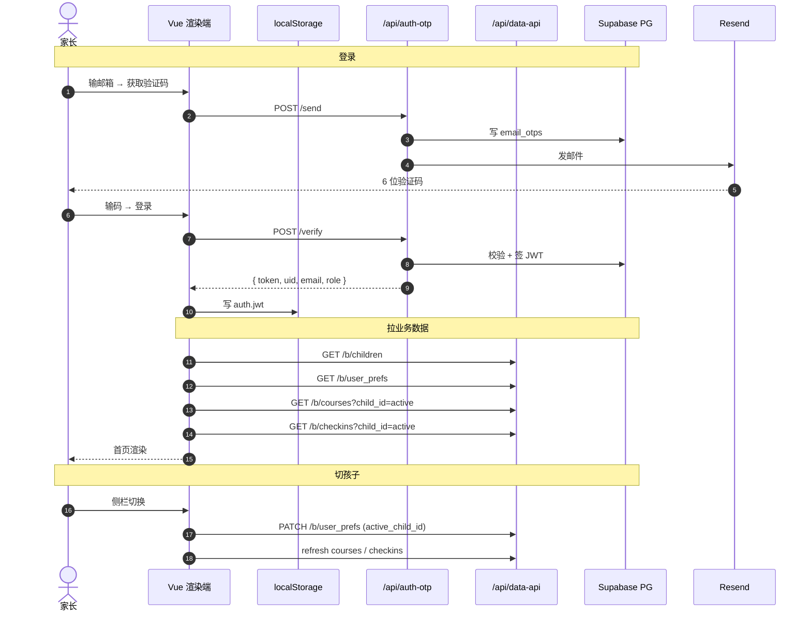

# 一寸光阴 · desktop

> 家长自用的孩子课外培训班课程 / 缴费 / 打卡 / 课时统计桌面应用（Windows + Electron 33）

**云端同步、单账号、多孩子、多设备登录看到一致数据；深 / 浅 / 跟随系统 3 档主题。**

---

## 1. 这是什么

帮你回答"我给孩子在课外班到底花了多少钱、上了多少课时、还剩多少没上、什么时候到期"。

适合：

- 给多个孩子（兄弟姐妹）分别记账
- 同时在钢琴、游泳、绘画、跆拳道、学科辅导等多个班上课
- 想知道每个班**单节均价**、**已上 / 总课时**、**临近到期预警**
- 跨设备访问（家里电脑 / 公司电脑 / 笔记本登录看到一样的数据）
- 想 **Excel 导出** 给家人 / 老师看
- 想要深色 / 浅色 / 跟随系统 3 档主题

不适合：

- 多人协作、家庭成员共享（v0.4 还是单人单账号）
- 想存孩子作业、照片、老师评价（这只是个记账本）

---

## 2. 功能一览

| 模块 | 功能 |
|------|------|
| 🔐 **登录** | 邮箱 + 6 位验证码（OTP）**或**邮箱 + 密码（首次需验证码确认，30 天免登录，可随时改密） |
| 👶 **多孩子档案** | 1 账号下多孩子，切换时数据自动过滤；激活孩子云端同步（`user_prefs`） |
| 🏠 **首页总览** | 课程数 / 总投入 / 已上课时 / 剩余课时 / 即将到期预警 |
| 📚 **课程管理** | 增删改查、自动算单节均价 + 已上/剩余课时、到期日 |
| ✅ **打卡日历** | 月历视图，格子内直接显示每门课的**课时胶囊**（科目 + 节数），点日期看当天明细 |
| 📈 **统计分析** | ECharts 饼图 + 柱图 + 时间段筛选（图表自动跟随主题） |
| ⚙️ **数据管理** | Excel 导出（每门课一个 sheet）/ 认领旧账号数据 |
| 🎨 **主题切换** | 深色 / 浅色 / 跟随系统；localStorage 兜底，云端同步 best-effort |
| 🔄 **自动更新** | 启动时检查 GitHub Release，有新版本弹窗提示 |
| 🎨 **设计风格** | 薄荷绿 + 米色卡片风（浅）/ 暗色玻璃卡（深），ECharts 配色跟随 |

---

## 3. 架构概览

### 3.1 部署视图

```
┌────────────────────────────────────────────────────────┐
│  Electron 桌面端 (Windows)                              │
│  Vue 3.5 + Pinia + Vite + Element Plus + Tailwind       │
│  └─ 3 档主题：theme.css（CSS 变量）+ chartTheme.ts（ECharts） │
└──────────────────────┬─────────────────────────────────┘
                       │ fetch VITE_AUTH_OTP_URL / VITE_DATA_API_URL
                       │   Authorization: Bearer <自签 JWT>
                       ▼
┌────────────────────────────────────────────────────────┐
│  Vercel Functions（Node 20）                            │
│  ├─ /api/auth-otp   发码/验码/注册/改密/密码登录          │
│  │                 （scrypt + 自签 JWT）                 │
│  └─ /api/data-api   业务 CRUD（/b/*）                     │
│  postgres.js 直连（postgres 角色, BYPASSRLS）            │
└──────────────────────┬─────────────────────────────────┘
                       ▼
┌────────────────────────────────────────────────────────┐
│  Supabase PostgreSQL                                    │
│  ├─ children / courses / checkins / user_prefs /         │
│  │  email_otps / user_passwords / backups                │
│  ├─ RLS 已开 + FORCE + anon 权限 revoke                   │
│  └─ pg_cron 每日备份 → backups 表                       │
└────────────────────────────────────────────────────────┘
```

### 3.2 端到端流程



更详细的架构 + 时序图 + 数据流见 [`../AGENTS.md` §2 架构总览](../AGENTS.md)。

---

## 4. 快速开始

### 4.1 环境要求

- **Node.js** ≥ 20
- **pnpm** ≥ 10
- **Windows 10/11**（macOS / Linux 需自行调 electron-builder target）

### 4.2 安装

```powershell
# 国内加速
$env:ELECTRON_MIRROR='https://npmmirror.com/mirrors/electron/'
pnpm install
```

### 4.3 启动开发模式

```powershell
pnpm dev          # Vite + Electron + DevTools 自动开
pnpm dev:web      # 只跑 Vite（不开 Electron）
```

dev 数据落在 `%USERPROFILE%\AppData\Roaming\Electron\course-tracker\`

### 4.4 打包发布

**推荐走 CI**（见 `../docs/release-guide.md`）—— 推 `v*` tag 自动跑 NSIS + portable + 上传 release 资产。

本地手跑（仅用于调试）：

```powershell
# 完整流程：类型检查 + 渲染端构建 + 主进程编译
pnpm run build

# 出 NSIS 安装器 + portable 绿色版
# ⚠️ Windows Defender 锁 asar 时，给 output 加时间戳绕开
pnpm exec electron-builder --win nsis portable --x64 --config.directories.output="release/$(Get-Date -Format 'yyyyMMdd-HHmmss')"
```

产物（app.asar 已排除 node_modules，Vite/esbuild 已把依赖打进 dist）：

- `release/<ts>/TimeWell-0.4.6-x64.exe` — NSIS 安装器 ~79 MB
- `release/<ts>/TimeWell-0.4.6-portable-x64.exe` — 绿色版 ~79 MB
- `release/<ts>/win-unpacked/一寸光阴.exe` — 解包的可执行（~272 MB，含 Electron 引擎）

**已发布版本下载（GitHub Release）**：<https://github.com/wangshaojie/electron-kid-course-tracker/releases>

### 4.5 生产模式启动

```powershell
# 默认不开 DevTools
pnpm exec electron dist-electron/main.mjs

# 强制开 DevTools
pnpm exec electron dist-electron/main.mjs --open-devtools
# 或
$env:OPEN_DEVTOOLS='1'; pnpm exec electron dist-electron/main.mjs
```

---

## 5. 目录速览

```
desktop/
├── electron/              # 主进程 + preload
│   ├── main.ts            # 窗口 / DevTools 策略 / IPC / boot.log
│   ├── updater.ts         # 版本检查（GitHub 双通道）
│   └── preload.ts
├── src/
│   ├── main.ts            # 入口：theme 早期应用 + auth bootstrap → router.isReady → mount
│   ├── App.vue            # 顶层：登录态切换 + loadBusinessData + theme sync
│   ├── router/index.ts    # 5 页面 + 守卫（4 业务页 + Login）
│   ├── views/
│   │   ├── Home.vue  Courses.vue  Checkins.vue
│   │   ├── Stats.vue  Settings.vue  Login.vue
│   ├── components/
│   │   ├── common/        # AppLayout / EmptyState / StatCard / AlertBanner
│   │   ├── child/         # ChildSwitcher / ChildCreateDialog
│   │   ├── course/        # CourseTable / CourseFormDialog
│   │   ├── checkin/       # CheckinFormDialog / CheckinTable / CheckinCalendar
│   │   ├── stats/         # CostPieChart / HoursBarChart / ChartBase
│   │   ├── account/       # ChangePasswordDialog / ForgotPasswordDialog / RegisterDialog / PasswordStatusCard
│   │   └── brand/         # BrandLogo
│   ├── stores/            # Pinia
│   │   ├── auth.ts        # JWT session + userRev
│   │   ├── children.ts    # 含 user_prefs 激活孩子同步
│   │   ├── courses.ts     # 客户端聚合 used/remain/单节均价
│   │   ├── checkins.ts    # 打卡 + 课时预校验
│   │   ├── theme.ts       # 3 档主题（dark/light/system）+ localStorage 兜底 + user_prefs 云端同步
│   │   └── db.ts          # 占位（云端版本不再本地存）
│   ├── styles/
│   │   ├── index.css      # Tailwind 入口
│   │   └── theme.css      # 3 档主题 CSS 变量（:root / [data-theme=light] / [data-theme=dark]）
│   ├── utils/
│   │   ├── chartTheme.ts  # ECharts 配色（动态读 CSS 变量）
│   │   ├── courseColor.ts
│   │   ├── date / money / excel / validators / confirm / email
│   ├── lib/cloudbase.ts   # SDK 初始化（已脱钩 CloudBase，名字沿用历史）+ otpSend/Verify + JWT session
│   ├── types/             # 共享 TS 类型
│   └── env.d.ts
├── scripts/
│   └── theme-migration/   # 一次性 python 脚本（v0.4.6 主题重构用，已跑过，保留供回溯）
├── build/                 # 打包资源（icon / NSIS BMP / LICENSE / installer.nsh）
├── build-electron.mjs     # esbuild 编译主进程
├── vite.config.ts
├── tailwind.config.js
├── tsconfig.json
├── package.json
├── AGENTS.md              # 桌面端专属约定（先读）
└── README.md              # 你正在读
```

---

## 6. 环境配置

### 6.1 .env 文件

Vite 在 `dev` / `build` / `preview` 三种 mode 下读不同文件：

- `.env.development` → dev 模式（`pnpm dev`）
- `.env.production` → build 模式（`pnpm run build:web`）
- `.env.example` → 模板（提交到 git）

**两个文件必须同时配**，否则打包版启动会白屏（生产 Vite 不会 fallback 读 .env.development）。

### 6.2 必填变量

| 变量 | 说明 |
|---|---|
| `VITE_AUTH_OTP_URL` | `/api/auth-otp` 根 URL（如 `https://<your-project>.vercel.app/auth-otp`） |
| `VITE_DATA_API_URL` | `/api/data-api` 根 URL（如 `https://<your-project>.vercel.app/data-api`） |

**只这 2 个**。Vercel Functions 直接吃请求头里的 `Authorization: Bearer <jwt>`，不需要额外 SDK 凭据。

### 6.3 JWT / 登录态

`lib/cloudbase.ts` 自己管 session：

- `localStorage` — 30 天免登录
- `sessionStorage` — 关 tab 即失效
- key 前缀：`auth.jwt` / `auth.user` / `auth.uid` / `auth.remember` / `auth.lastEmail`

切换账号时 **必须** 走 App.vue 的 `resetBusinessState()` + `watch(auth.user?.uid)`，否则业务 store 会残留上一个账号的数据。

### 6.4 主题持久化

`stores/theme.ts` 持久化分两层：

1. **本地**：`localStorage['app.theme']`（永远生效）
2. **云端**：`user_prefs.theme`（best-effort，登录后同步）

如果 `user_prefs.theme` 列不存在（migration 没跑），会自动降级为"只本地"，**不会**刷屏报错。完整的多设备同步需先在 Supabase 跑 `supabase/migrations/20260909140000_user_prefs_theme.sql`。

---

## 7. 主题系统（v0.4.6 新增）

3 档主题：**深色** / **浅色** / **跟随系统**

- **入口**：侧栏底部 🌙 / ☀️ 按钮
- **存储**：`stores/theme.ts`（Pinia）+ `localStorage` + `user_prefs.theme`
- **应用**：
  - `<html data-theme="dark|light">` 切换 `styles/theme.css` 里的 CSS 变量
  - `system` 模式不设 `data-theme`，让 `@media (prefers-color-scheme)` 接管
- **ECharts**：`utils/chartTheme.ts` 动态读 CSS 变量，图表配色跟随
- **实现位置**：
  - `src/stores/theme.ts` —— 状态 + 持久化
  - `src/styles/theme.css` —— 颜色变量（`--page-bg-1` / `--card-bg` / `--text-title` 等）
  - `src/utils/chartTheme.ts` —— ECharts option 颜色注入
  - `src/main.ts` —— 启动早期直接 `applyTheme()` 走 localStorage，避免闪屏

**新增颜色**：不要重跑 `scripts/theme-migration/`。直接改 `theme.css` 变量值即可。

---

## 8. 上线前检查清单

详见 `../AGENTS.md` §9 完整版，下面是 **必须** 项：

- [x] **轮换 publishable key**（已迁移 Vercel 后不再需要；Supabase anon key 仅用于本地调试）
- [x] **RLS 已收紧** + anon 权限已 revoke（migration `20260817000000_business_anon_harden.sql`）
- [x] **OTP 限流按 email + IP 双维度**（`auth-otp` 已实现 `OTP_RATE_LIMIT_MS` + `OTP_EMAIL_HOUR_LIMIT`）
- [x] **每日 PG 备份 cron**（Supabase 端 `pg_cron` + `pg_backups` 表）
- [x] **package.json 显式补 `repository` 字段**（v0.4.5 CI 修复，electron-builder NSIS 写 `latest.yml` 必需）
- [ ] **NSIS 代码签名**（避免 SmartScreen 警告）
- [ ] tsc 0 错误（`pnpm exec vue-tsc --noEmit`）
- [ ] CI 产物（NSIS + portable + blockmap + latest.yml）齐

---

## 9. 常见问题

### Q1: 启动白屏？

打开 DevTools（dev 模式自动开；生产 `--open-devtools`）。看 console。

最常见原因：

- **生产模式 `.env.production` 没配 2 个 `VITE_*` URL**（打包版 Vite 不会读 `.env.development`）
- Vercel 函数 URL 拼错（注意 `/auth-otp` `/data-api` 路径，vercel.json rewrites 已经处理 `/api/*` 前缀）

### Q2: 登录后看到 "当前账号下没有孩子数据"？

三种可能：

1. 新用户 → 去设置页 + 新增孩子
2. 之前用别的邮箱录过数据 → 在设置页「🔄 认领旧账号数据」输入旧 `owner_id` 认领
3. 本地登录态异常 → 退出登录重新进

### Q3: 切换账号后看到上一个账号的数据？

如果新包（v0.4.0+，2026-09-08 之后打的）还出现：清 localStorage（DevTools → Application → Storage → Clear site data）后重试。

### Q4: 主题切换不生效？

1. 检查 `localStorage['app.theme']` 是否有 `dark` / `light` / `system` 之一
2. 检查 `<html data-theme="...">` 属性是否设置（`system` 模式应为空，靠 CSS `@media` 接管）
3. 强制 reload：Ctrl+Shift+R

### Q5: 主题在不同设备不一致？

云端 `user_prefs.theme` 同步是 best-effort，需要：

1. 已在 Supabase 跑过 `supabase/migrations/20260909140000_user_prefs_theme.sql`（加了 theme 列）
2. 登录态有效（`auth.uid` 非空）
3. 看 console 是否有 `[theme] 云端 user_prefs.theme 不可用` 警告 → 是 migration 没跑

### Q6: 打包失败 "file used by another process"？

**Windows Defender 锁 app.asar** —— 旧目录被 MsMpEng 持 mmap 句柄。**给 output 加时间戳绕开**：

```powershell
pnpm exec electron-builder --win nsis --x64 --config.directories.output="release/$(Get-Date -Format 'yyyyMMdd-HHmmss')"
```

详见 agent memory。

### Q7: dev 模式跑起来 electron 进程没退？

`Stop-Process -Name electron -Force`，或去任务管理器关。

### Q8: 端口冲突？

Vite 默认 5174，被占会自动跳 5175/5176/... 不影响。

### Q9: admin 页面 — 已下线（v0.6+）

v0.3-v0.5.x 上线的管理员后台已在 v0.6 移除。无需再为 admin 配置 env。

---

## 10. 版本日志

### v0.4.6 (2026-09-09) — 主题系统重构

- ✨ **主题切换**：深 / 浅 / 跟随系统 3 档，CSS 变量统一入口
- ✨ **ECharts 主题适配**：`utils/chartTheme.ts` 动态读 CSS 变量
- ⚡ **业务数据并行拉取**：`children` + `user_prefs` 走 `Promise.all`
- ⚡ **启动 loading 重做**：只盖内容区（侧栏立即可见）+ 玻璃卡
- 🐛 **el-message-box / el-message 样式兜底**：unplugin 按需模式漏 CSS，手动 import
- 🐛 **CI 修复**：desktop/package.json 显式补 `repository` 字段（NSIS `latest.yml` 需要）
- 🐛 **data-api 单文件**：Vercel catch-all 不稳，改 `?path=` 转发
- 🗄 **数据库**：`user_prefs` 加 `theme` 列（migration 20260909140000）
- 📚 **文档**：所有 README/AGENTS/release-guide 按 v0.4.6 实际架构重写

### v0.4.5 (2026-09-08) — 启动体验 + CI 修复

- ✨ **启动 loading 重做**：玻璃卡 + 暗色底
- 🐛 **el-message 样式兜底**
- 🐛 **CI 修复**：缺 `repository` 字段导致 NSIS 失败
- 🐛 **data-api CORS 修复**

### v0.4.0~v0.4.4 (2026-08~09)

- ✨ **密码登录**：scrypt + 验证码确认邮箱所有权
- ✨ **NSIS 自动更新**（electron-updater）：latest.yml + blockmap
- ✨ **v0.4.0 数据修复**：删课 / 删宝贝级联清打卡 + 二次确认

### v0.3.0 (2026-08)

- ✨ **CloudBase → Supabase 迁移** + Vercel Functions
- ✨ **密码登录**（OTP 主，密码辅）
- ✨ **改密流程**

### v0.2.x (2026-08-14)

- ✅ **云端同步**：所有业务数据走 Supabase PG，多设备登录一致
- ✅ **OTP 登录**：邮箱 + 6 位验证码 + 自签 JWT（30 天免登录）
- ✅ **激活孩子云端同步**：`user_prefs` 表 + `children.load` 决策链
- ✅ **账号切换不残留**：resetBusinessState + uid watch + loadingPromise 单飞
- ✅ **认领旧账号数据**：设置页可视化把别人 owner_id 改成自己的
- 🐛 **修**：之前"两个账号数据一样"——根因是 Pinia store 切换账号没清空

### v0.2.0 (2026-08-12)

- ✅ **多孩子档案** + **首次启动向导** + **孩子切换器** + **打包 NSIS**

### v0.1.0

- 单孩子 / 课程 / 打卡 / 统计 / Excel 导出（sql.js 本地版）

---

## 11. 隐私

本应用：

- ✅ **同步到 Supabase PG** —— 你的所有课程 / 打卡 / 主题偏好数据
- ✅ 邮箱 → sha256 当 uid（不存原邮箱作为主键）
- ✅ 30 天免登录的 JWT 存 localStorage
- ❌ 不弹广告、不引导付费、不收集使用遥测
- ❌ 不上传统计数据到任何第三方

云端数据可随时在设置页导出 Excel；删除账号 = 删 Supabase `email_otps` 记录 + 清空 localStorage + 业务表 `owner_id` 改成 `<orphan>`（联系开发者手动删）。
