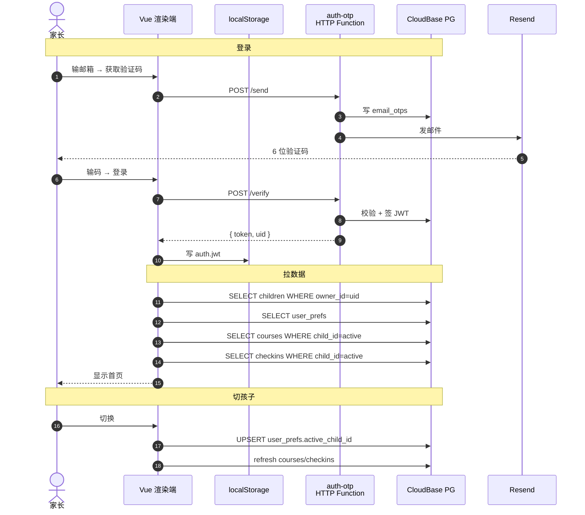

# 一寸光阴 · desktop

> 家长自用的孩子课外培训班课程 / 缴费 / 打卡 / 课时统计桌面应用（Windows + Electron 33）

**云端同步、单账号、多孩子、多设备登录看到一致数据。**

---

## 1. 这是什么

帮你回答"我给孩子在课外班到底花了多少钱、上了多少课时、还剩多少没上、什么时候到期"。

适合：
- 给多个孩子（兄弟姐妹）分别记账
- 同时在钢琴、游泳、绘画、跆拳道、学科辅导等多个班上课
- 想知道每个班**单节均价**、**已上 / 总课时**、**临近到期预警**
- 跨设备访问（家里电脑 / 公司电脑 / 笔记本登录看到一样的数据）
- 想 **Excel 导出** 给家人 / 老师看

不适合：
- 多人协作、家庭成员共享（v0.2 还是单人单账号）
- 想存孩子作业、照片、老师评价（这只是个记账本）

---

## 2. 功能一览

| 模块 | 功能 |
|------|------|
| 🔐 **OTP 登录** | 邮箱 + 6 位验证码（30 天免登录） |
| 🏠 **首页总览** | 课程数 / 总投入 / 已上课时 / 剩余课时 / 即将到期预警 |
| 👶 **多孩子档案** | 1 账号下多孩子，切换时数据自动过滤；激活孩子云端同步 |
| 📚 **课程管理** | 增删改查、自动算单节均价 + 已上/剩余课时、到期日 |
| ✅ **上课打卡** | 选课程 / 日期 / 节数 / 反馈；自动扣剩余；防止变负 |
| 📈 **统计分析** | ECharts 饼图 + 柱图 + 时间段筛选 |
| ⚙️ **数据管理** | Excel 导出（跨孩子全量）/ 认领旧账号数据 |
| 🎨 **设计风格** | 薄荷绿 + 米色卡片风 |

---

## 3. 架构概览

### 3.1 部署视图

```
┌────────────────────────────────────────────────────────┐
│  Electron 桌面端 (Windows)                              │
│  └─ Vue 3 + Pinia + Vite 渲染端                         │
│       └─ CloudBase PG (children/courses/checkins/...)  │
│            ↑ service role (cloud function 持密钥)        │
│            ↑ PostgREST (前端 SDK anon key)              │
└────────────────────────────────────────────────────────┘
```

### 3.2 端到端流程



数据流：
- **登录** → `auth-otp` HTTP Function 发 6 位码 + 验码 + 签 JWT（uid = sha256(email)）
- **业务** → 渲染端 SDK 直连 PG，所有读写显式 `.eq('owner_id', uid)` 过滤
- **激活孩子** → 写入 `user_prefs`（owner_id PK），跨设备登录自动恢复

更详细的架构 + 数据流 + 时序图见 [`../AGENTS.md` §2 架构总览](../AGENTS.md)。

---

## 4. 快速开始

### 4.1 环境要求

- **Node.js** ≥ 20
- **pnpm** ≥ 10
- **Windows 10/11**（macOS / Linux 需自行调 electron-builder target）

### 4.2 安装

```powershell
# 国内加速
$env:ELECTRON_MIRROR='https://npmmirror.com/mirrors/electron/'

pnpm install
```

### 4.3 启动开发模式

```powershell
pnpm dev          # Vite + Electron + DevTools 自动开
pnpm dev:web      # 只跑 Vite（不开 Electron）
```

dev 数据落在 `%USERPROFILE%\AppData\Roaming\Electron\course-tracker\`

### 4.4 打包发布

```powershell
# 完整流程：类型检查 + 渲染端构建 + 主进程编译
pnpm run build

# 出 NSIS 安装器 + portable 绿色版
# ⚠️ Windows Defender 锁 asar 时，给 output 加时间戳绕开
pnpm exec electron-builder --win nsis --x64 --config.directories.output="release/$(Get-Date -Format 'yyyyMMdd-HHmmss')"
pnpm exec electron-builder --win portable --x64 --config.directories.output="release/$(Get-Date -Format 'yyyyMMdd-HHmmss')"
```

产物：
- `release/<ts>/一寸光阴-0.2.0-x64.exe` — NSIS 安装器 ~101 MB
- `release/<ts>/一寸光阴-0.2.0-portable-x64.exe` — 绿色版 ~82 MB
- `release/<ts>/win-unpacked/一寸光阴.exe` — 解包的可执行

### 4.5 生产模式启动

```powershell
# 默认不开 DevTools
pnpm exec electron dist-electron/main.mjs

# 强制开 DevTools
pnpm exec electron dist-electron/main.mjs --open-devtools
# 或
$env:OPEN_DEVTOOLS='1'; pnpm exec electron dist-electron/main.mjs
```

---

## 5. 目录速览

```
desktop/
├── electron/              # 主进程 + preload
│   ├── main.ts            # 窗口 / DevTools 策略 / IPC / boot.log
│   └── preload.ts
├── src/
│   ├── main.ts            # 入口：auth bootstrap → router.isReady → mount
│   ├── App.vue            # 顶层：登录态 + loadBusinessData
│   ├── router/index.ts    # 5 页面 + 守卫
│   ├── views/             # 5 业务页 + Login
│   ├── components/        # common/child/course/checkin/stats
│   ├── stores/            # auth / children / courses / checkins / db
│   │   └── children.ts    # 含 user_prefs 激活孩子同步
│   ├── lib/cloudbase.ts   # SDK 初始化 + otpSend/Verify + JWT session
│   ├── types/  utils/  styles/
│   └── env.d.ts
├── build/                 # 打包资源（icon / NSIS BMP / LICENSE）
├── build-electron.mjs     # esbuild 编译主进程
├── vite.config.ts
├── tailwind.config.js
├── tsconfig.json
├── package.json
├── AGENTS.md              # 桌面端专属约定（先读）
└── README.md              # 你正在读
```

---

## 6. 环境配置

### 6.1 .env 文件

Vite 在 `dev` / `build` / `preview` 三种 mode 下读不同文件：

- `.env.development` → dev 模式（`pnpm dev`）
- `.env.production` → build 模式（`pnpm run build:web`）
- `.env.example` → 模板（提交到 git）

**两个文件必须同时配**，否则打包版启动会白屏（生产 Vite 不会 fallback 读 .env.development）。

### 6.2 必填变量

| 变量 | 说明 |
|---|---|
| `VITE_CLOUDBASE_ENV_ID` | CloudBase 环境 ID（如 `kid-course-tracker-d6c2816e966b5`） |
| `VITE_CLOUDBASE_ACCESS_KEY` | 匿名 publishable key |
| `VITE_CLOUDBASE_REGION` | 地域（默认 `ap-shanghai`） |
| `VITE_AUTH_OTP_URL` | `auth-otp` HTTP Function 根 URL（`https://<envId>.service.tcloudbase.com/auth-otp`） |

### 6.3 JWT / 登录态

`lib/cloudbase.ts` 自己管 session：
- `localStorage` — 30 天免登录
- `sessionStorage` — 关 tab 即失效
- key 前缀：`auth.jwt` / `auth.user` / `auth.uid` / `auth.remember` / `auth.lastEmail`

切换账号时 **必须** 走 App.vue 的 `resetBusinessState()` + `watch(auth.user?.uid)`，否则业务 store 会残留上一个账号的数据。

---

## 7. 上线前检查清单

详见 `../AGENTS.md` §9 完整版，下面是 **必须** 项：

- [ ] **轮换 publishable key**（已泄露在历史对话里）
- [ ] **重新启用 PG RLS**，业务读写改走 cloud function
- [x] **OTP 限流按 email + IP 双维度**（`auth-otp` 已实现：`OTP_RATE_LIMIT_MS` + `OTP_EMAIL_HOUR_LIMIT`）
- [ ] **每日 PG 备份 cron**（`pg-backup` Event 函数已写，需配定时触发）
- [ ] **NSIS 代码签名**（避免 SmartScreen 警告）
- [ ] tsc 0 错误（`npx vue-tsc --noEmit`）
- [ ] 打包 release 用时间戳 output 目录

---

## 8. 常见问题

### Q1: 启动白屏？

打开 DevTools（dev 模式自动开；生产 `--open-devtools`）。看 console。

最常见原因：
- **生产模式 .env.production 没配 VITE_CLOUDBASE_* 变量**（打包版 Vite 不会读 .env.development）
- CloudBase SDK init 失败：检查 envId 和 publishable key

### Q2: 登录后看到 "当前账号下没有孩子数据"？

三种可能：
1. 新用户 → 去设置页 + 新增孩子
2. 之前用别的邮箱录过数据 → 在设置页「🔄 认领旧账号数据」输入旧 owner_id 认领
3. 本地登录态异常 → 退出登录重新进

### Q3: 切换账号后看到上一个账号的数据？

如果新包（v0.2.0+，2026-08-14 之后打的）还出现：清 localStorage（DevTools → Application → Storage → Clear site data）后重试。

### Q4: 打包失败 "file used by another process"？

**Windows Defender 锁 app.asar** —— 旧目录被 MsMpEng 持 mmap 句柄。**给 output 加时间戳绕开**：

```powershell
pnpm exec electron-builder --win nsis --x64 --config.directories.output="release/$(Get-Date -Format 'yyyyMMdd-HHmmss')"
```

详见 agent memory。

### Q5: dev 模式跑起来 electron 进程没退？

`Stop-Process -Name electron -Force`，或去任务管理器关。

### Q6: 端口冲突？

Vite 默认 5174，被占会自动跳 5175/5176/... 不影响。

---

## 9. 版本日志

### v0.2.x (2026-08-14)
- ✅ **云端同步**：所有业务数据走 CloudBase PG，多设备登录一致
- ✅ **OTP 登录**：邮箱 + 6 位验证码 + 自签 JWT（30 天免登录）
- ✅ **激活孩子云端同步**：`user_prefs` 表 + `children.load` 决策链
- ✅ **账号切换不残留**：resetBusinessState + uid watch + loadingPromise 单飞
- ✅ **认领旧账号数据**：设置页可视化把别人 owner_id 改成自己的
- ✅ **账号下没孩子的明确提示**：不再被让"新建孩子"
- 🐛 **修**：之前"两个账号数据一样"——根因是 Pinia store 切换账号没清空
- 🐛 **修**：OTP 限流 / 备份 cron / publishable key 风险点已识别（TODO）

### v0.2.0 (2026-08-12)
- ✅ **多孩子档案**：孩子表 + child_id FK 强绑定
- ✅ **首次启动向导**
- ✅ **孩子切换器**
- ✅ **打包 + NSIS 安装器**

### v0.1.0
- 单孩子 / 课程 / 打卡 / 统计 / Excel 导出（sql.js 本地版）

---

## 10. 隐私

本应用：
- ✅ **同步到云端**（CloudBase PG）—— 你的所有课程/打卡数据
- ✅ 邮箱 → sha256 当 uid（不存原邮箱作为主键）
- ✅ 30 天免登录的 JWT 存 localStorage
- ❌ 不弹广告、不引导付费、不收集使用遥测
- ❌ 不上传统计数据到任何第三方

云端数据可随时在设置页导出 Excel；删除账号 = 删 CloudBase `email_otps` 记录 + 清空 localStorage + 业务表 owner_id 改成 `<orphan>`（联系开发者手动删）。
